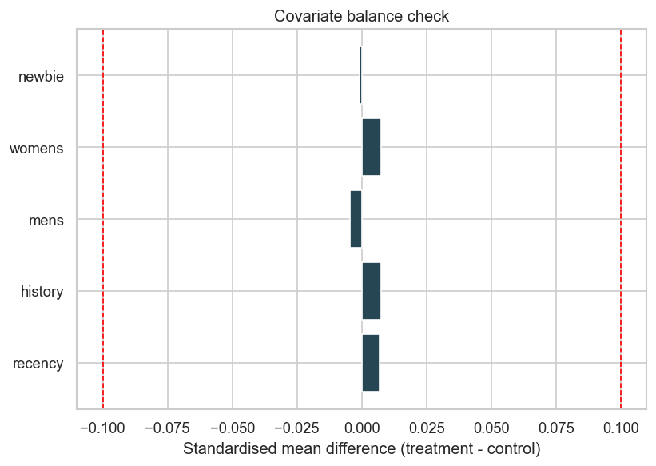
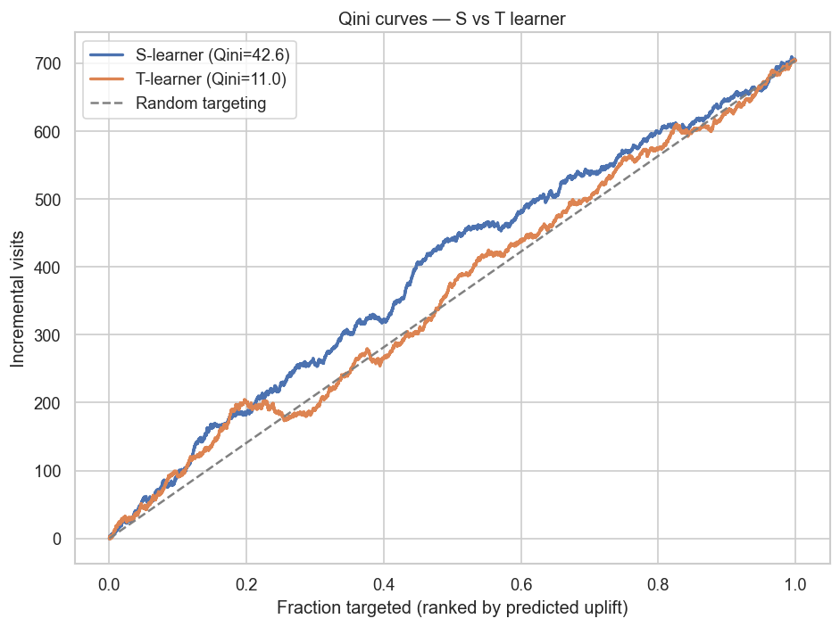
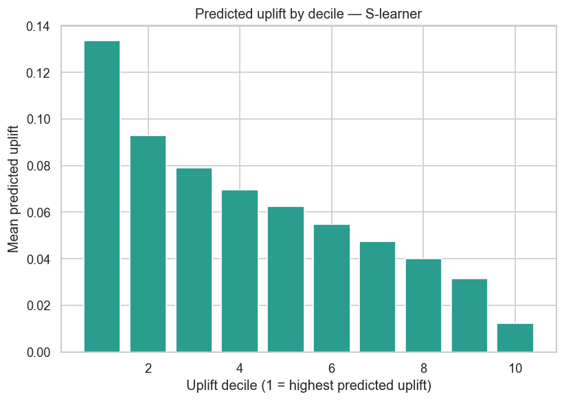
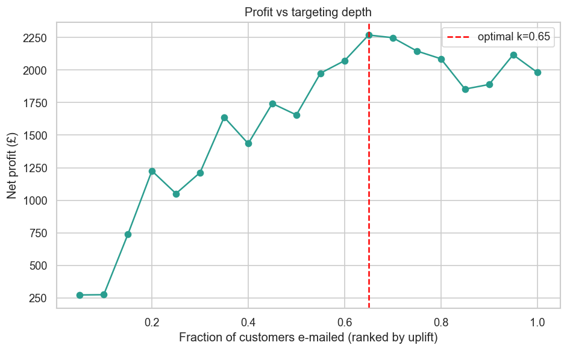
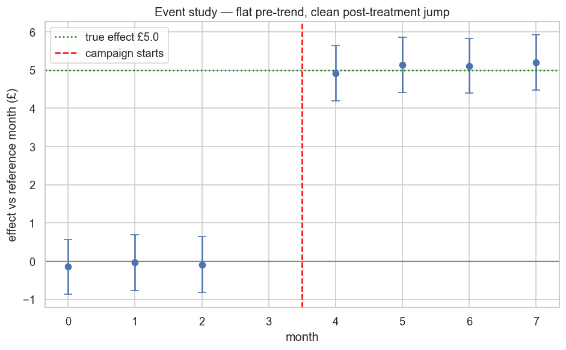

# E-Mail Uplift & Causal Inference

[](https://www.python.org/)
[](https://scikit-learn.org/)
[](https://lightgbm.readthedocs.io/)
[](https://scipy.org/)
[](https://www.statsmodels.org/)

Most marketing models predict *who will convert*. That is the wrong question. A
customer who would buy anyway needs no e-mail, and a customer the e-mail annoys
should never receive one. The right question is **causal**: for whom does the
e-mail *change* behaviour? This project answers it end-to-end on a real
randomised experiment — from validating the randomisation, through rigorous A/B
analysis, to individual-level **uplift modeling** and a profit-optimal
**targeting policy**.

**Dataset:** Hillstrom / MineThatData e-mail challenge — 64,000 customers,
randomised into *Mens E-Mail*, *Womens E-Mail*, *No E-Mail*
**Headline A/B result:** Mens E-Mail lifts visit rate **+72%** (p < 1e-16) and
conversion **+119%** (p = 1.5e-13)
**Best uplift model:** S-learner (Qini **42.6** vs T-learner 11.0)
**Business impact:** uplift-targeting the top ~65% by predicted uplift yields
**+14% net profit** vs e-mailing everyone, while contacting **35% fewer** people
**Stack:** Python 3.11 · scikit-learn · LightGBM · SciPy · statsmodels · matplotlib

---

## Why this project

A/B tests give the **average** treatment effect. Uplift modeling gives the
**individual** effect, which is what a finite budget actually needs. This repo
demonstrates the full causal-inference workflow a data scientist is expected to
own:

1. **Validate the experiment** before trusting it — randomisation balance, no
   sample-ratio mismatch.
2. **Analyse rigorously** — power/sample-size up front, lift + confidence
   intervals, multiple-comparison correction, CUPED variance reduction.
3. **Model heterogeneity** — S-, T-, X- and DR-learner meta-learners implemented
   from scratch, evaluated with the Qini curve.
4. **Drive a decision** — convert uplift scores into a profit-optimal targeting
   policy and compare against naive strategies.

---

## Project Structure

```
email-uplift-causal/
├── src/
│   ├── data/
│   │   ├── load.py           # load + integrity-check the Hillstrom data
│   │   └── features.py       # LightGBM-safe feature matrix
│   ├── experiment/
│   │   └── ab.py             # sample size, z-test, SRM, CUPED, Bonferroni
│   ├── uplift/
│   │   └── learners.py       # S/T/X/DR-learners + Qini curve/coefficient (from scratch)
│   ├── causal/
│   │   └── did.py            # Difference-in-Differences + parallel-trends + event study
│   └── evaluation/
│       └── plots.py          # Qini, uplift-decile, covariate-balance plots
├── notebooks/
│   ├── 01_eda_randomization.ipynb   # arm balance + randomisation check (SMD)
│   ├── 02_ab_analysis.ipynb         # power, z-test, SRM, Bonferroni, CUPED
│   ├── 03_uplift_modeling.ipynb     # S/T/X/DR learners, Qini curves
│   ├── 04_targeting_policy.ipynb    # profit curve + strategy comparison
│   └── 05_did.ipynb                 # Difference-in-Differences (observational case)
├── tests/                    # experiment + uplift + causal (DiD) unit tests
├── data/raw/                 # Hillstrom CSV (not committed)
├── reports/figures/          # generated plots
└── pyproject.toml
```

---

## Results

### 1. The experiment is valid

All numeric covariates have `|SMD| < 0.1` between the treated and control arms,
and the three arms are allocated almost exactly evenly — randomisation held, so
a difference in means is an unbiased treatment-effect estimate.



### 2. A/B analysis — Mens E-Mail vs control

| Metric | Control | Treatment | Lift | p-value | Significant (Bonferroni) |
|--------|---------|-----------|------|---------|--------------------------|
| Visit | 10.6% | 18.3% | **+72%** | < 1e-16 | ✅ |
| Conversion | 0.57% | 1.25% | **+119%** | 1.5e-13 | ✅ |
| Spend (£) | 0.65 | 1.42 | +£0.77 | 1.2e-07 | ✅ |

The experiment is well powered (18k+ per arm vs ~29k needed for a 20% MDE) and
shows **no sample-ratio mismatch** (χ² p = 0.996). CUPED with prior-spend as the
covariate removes little variance here — a useful negative result: CUPED only
pays off when the covariate genuinely predicts the metric.

### 3. Uplift modeling — four meta-learners compared

| Model | Qini coefficient |
|-------|------------------|
| **S-learner** | **42.6** |
| X-learner | 21.3 |
| T-learner | 11.0 |
| DR-learner | 3.9 |
| Random targeting | 0.0 |

The T-learner differences two separately-trained models; on a ~15% base-rate
binary outcome that noise dominates and its Qini curve sits close to random. The
**X-learner** repairs exactly this — its second stage imputes individual effects
and fits a dedicated CATE regressor — and duly beats the T-learner. The
**S-learner**, sharing one model with treatment as a feature, is the most stable
ranker here. The **DR-learner**'s single-split doubly-robust pseudo-outcome is
high-variance for *ranking* individual effects on a binary outcome (doubly-robust
estimation pays off more for the *average* policy value — see the sibling recsys
off-policy-evaluation project); cross-fitting would cut this variance.



The decile view exposes a genuinely negative-uplift tail — customers the e-mail
should *skip*, invisible to any response model.



### 4. Targeting policy — the value is in the decision layer

Using illustrative economics (£0.10 per e-mail, £45 per incremental
conversion), net profit peaks at an intermediate targeting depth:



| Strategy | Customers e-mailed | Net profit (test set) |
|----------|-------------------|-----------------------|
| Treat no one | 0 | £0 |
| Treat everyone | 19,200 | £1,982 |
| **Uplift-targeted (top 65%)** | **12,480** | **£2,269 (+14%)** |

Same creative, same experiment — the extra profit comes entirely from *not*
spending budget on zero- and negative-uplift customers.

### 5. Difference-in-Differences — the observational case

Notebooks 02–04 need a clean experiment. Notebook 05 handles the common case
where none exists — a campaign rolled out to one region at one time — with DiD.
On a semi-synthetic panel carrying a **known £5 effect**:

| Estimator | Estimate | Verdict |
|-----------|----------|---------|
| Naive before-after | ~£8.3 | ❌ inflated — absorbs the common time trend |
| **Difference-in-Differences** | **~£5.2** (95% CI covers £5) | ✅ recovers the truth |

A **parallel-trends test** on the pre-period licenses the estimate, and an
**event study** confirms it: flat pre-treatment, clean jump at rollout.



This closes the causal toolkit — **randomised uplift** for when you can
experiment, **DiD** for when you can only observe.

---

## Quickstart

```bash
# 1. install
pip install -e ".[dev]"

# 2. download the dataset into data/raw/
curl -L -o data/raw/hillstrom.csv \
  "http://www.minethatdata.com/Kevin_Hillstrom_MineThatData_E-MailAnalytics_DataMiningChallenge_2008.03.20.csv"

# 3. run the notebooks in order (01 → 04)

# 4. run the tests
python -m pytest tests/ -v
```

---

## Technical Notes

- **Causal validity first:** randomisation is checked with standardised mean
  differences before any effect is estimated; SRM is tested before results are
  trusted.
- **Report effects, not just p-values:** every comparison reports lift with a
  95% confidence interval; multiple metrics are Bonferroni-corrected.
- **Uplift from scratch:** S/T-learners and the Qini curve/coefficient are
  implemented directly on top of scikit-learn/LightGBM — no black-box uplift
  library — to make the mechanics explicit and testable.
- **Honest evaluation:** the S-vs-T-learner comparison reports the T-learner's
  weakness rather than hiding it; the CUPED result is reported even though it is
  small on this metric.
- **Decision-focused:** the project ends at a business policy with an explicit
  cost model, not at a metric.

---

## Caveats

The £0.10 / £45 figures are illustrative — in production they come from finance,
and any targeting policy would be validated on a fresh randomised holdout before
rollout. The dataset is from 2008 and is used here as a public benchmark for the
methodology, which is the transferable asset.
